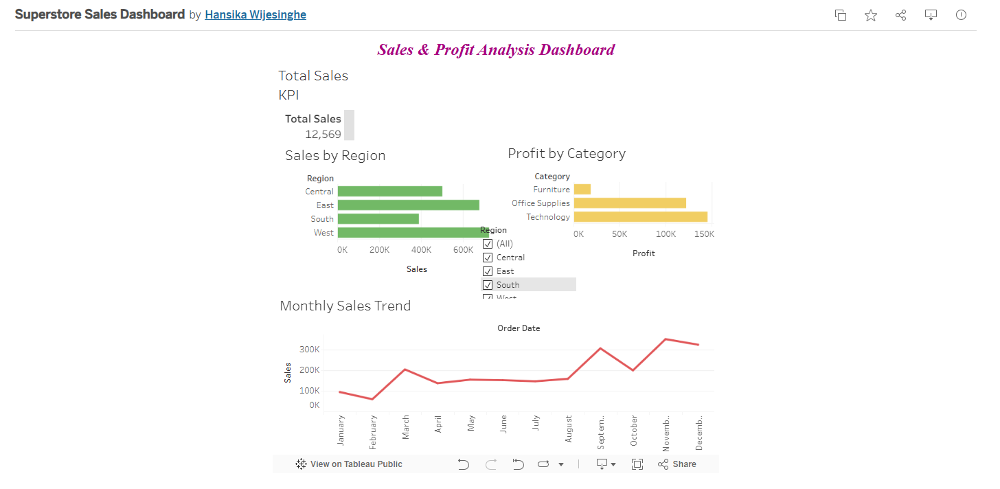

# Superstore Sales Dashboard using Tableau

## Project Overview
This project is an interactive sales dashboard created using Tableau Public.  
The dashboard analyzes sales, profit, regional performance, category-wise profit, and monthly sales trends using the Sample Superstore dataset.

## Tools Used
- Tableau Public
- Sample Superstore Dataset
- Data Visualization
- Dashboard Design

## Dashboard Features
- Total Sales KPI
- Sales by Region
- Profit by Category
- Monthly Sales Trend
- Interactive Region Filter

## Key Insights
- Identified sales performance across different regions.
- Compared profit by product categories.
- Analyzed monthly sales trends.
- Used filters to make the dashboard interactive.

## Live Tableau Dashboard
https://public.tableau.com/app/profile/hansika.wijesinghe/viz/SuperstoreSalesDashboard_17796424934870/Dashboard1?publish=yes 

## Dashboard Preview

## What I Learned
Through this project, I learned how to:
- Connect a dataset to Tableau
- Create bar charts and line charts
- Create KPI cards
- Add filters
- Build an interactive dashboard
- Present business data visually

